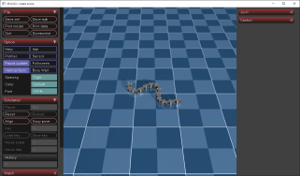
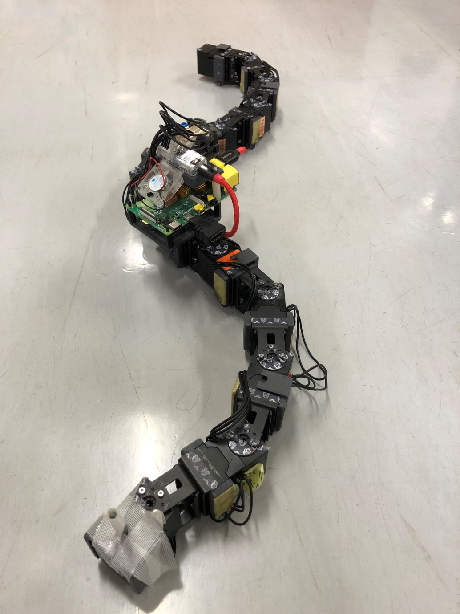

# TESP引継ぎ用
## 概要 Overview

・MuJoCo上の蛇型ロボットをMediaPipeを用いて制御し、迷路を攻略する
・MediaPipeを用いて実機の蛇型ロボットを制御する

### MediaPipe
画像や映像から人体の関節などの特徴となる位置を検出するフレームワーク・モジュール

### MuJoCo
ロボット工学、生体力学、機械学習等のユーズケースに合わせて作られた物理エンジン

### Real Snake Robot
12個のサーボモータからなる蛇型のロボット、今回は研究室にあるRaspberryPi上に受け取った目標値に対してサーボ制御を行うコードが書かれているので、pc側から指令値を送るコードを書けばよい

## 2024年の流れ
1. 環境構築(Anaconda, vscodeのインストール、仮想環境の構築、必要なパッケージのインストール)
2. MuJoCo上で蛇ロボットを制御する
3. MediaPipeを用いてMuJoCo上の蛇ロボットを制御
4. 実機の蛇ロボットをMediaPipeによって制御
5. MuJoCo上で迷路を作成
6. 発表に向けて上記のコードをブラッシュアップ、発表資料作成

## フォルダ構成
### TESP2024
昨年度使用したTESP用のリポジトリ

### Setup
環境構築についてまとめたフォルダ
